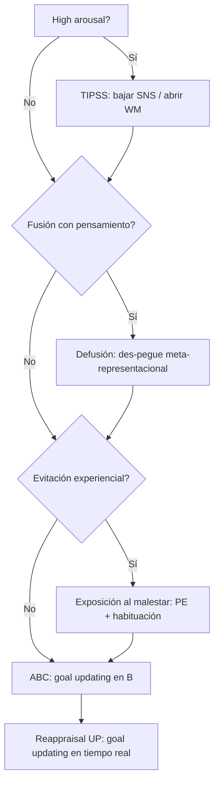

# Marco computacional — S09 Distress (Rohlfing et al. 2025 × RDoC × curso)

**Paper ancla:** Rohlfing N, Pum M, Bonnet U, Koelkebeck K, Scherbaum N. *Psychotherapy Research Domain Criteria: functional mechanisms of treatment and a basic theory of the mind.* Front Psychiatry. 2025. doi:[10.3389/fpsyt.2025.1549976](https://doi.org/10.3389/fpsyt.2025.1549976) · PMID 40612031.

**Función en S09:** lenguaje unificador para explicar **por qué** el toolkit tiene secuencia (TIPSS → defusión/exposición → ABC/reappraisal) y **qué circuito** toca cada habilidad. No reemplaza evidencia clínica de cada escuela — las **traduce** a mecanismos falsables.

---

## 1. La ecuación (computational core del paper)

```
Necesidades (no satisfechas) 
    → evaluación de experiencias (mecanismo)
        → sesgos cognitivos / representaciones semánticas autocontenidas (TARGET)
            → reappraisal + control cognitivo (INTERVENCIÓN PRINCIPAL del paper)
```

**Traducción al Bloque 3 (distress):**
- **Necesidades:** apego, control/orientación, autoestima, evitación del dolor (Grawe → Rohlfing).
- **No-satisfacción** en distress = constructos RDoC **Loss** + **Sustained Threat** (S08).
- **Sesgo central en distress:** generalizaciones en WM (“nunca voy a estar bien”, “no puedo tolerar no saber”) que **bloquean** acceso a memoria episódica alternativa y mantienen prediction errors crónicos (Papalini 2020).

> **Postura del curso:** el **ABC de Ellis** es la forma clínica más transparente de atacar la **representación semántica en B** (goal updating sobre la evaluación). El **reappraisal UP** es la misma familia de control cognitivo en **tiempo real**. Las otras habilidades preparan el hardware para que eso funcione.

---

## 2. Arquitectura conductual (Fig. 1a–c) — versión distress

### 1A — Pipeline normal
`Ambiente → Atención → Evaluación emocional + WM → Motivación approach/avoidance → Conducta`  
En paralelo: `Memoria semántica + episódica → reward prediction (expectativa)`

### 1B — Lo que se rompe en distress (mecanismos no-adaptativos)

| Mecanismo disfuncional (Rohlfing) | Manifestación en distress | Motor S08 |
|---|---|---|
| **Mood-congruent retrieval bias** | Solo recupera episodios tristes/amenazantes | Rumiación |
| **Negative encoding bias** | Codifica confirmaciones negativas | IU + rumiación |
| **High arousal** | SNS activado; WM colapsa | Sustained threat agudo |
| **Impaired disengagement** | No suelta estímulo/pensamiento negativo | Rumiación |
| **↓ reward expectation / ↑ punishment expectation** | Anhedonia, anticipación catastrófica | Loss + IU |

→ Loop: la representación actual en WM **restringe percepción y acceso a LTM** — eso es el sesgo autocontenido de Rohlfing.

### 1C — Mapeo intervenciones (toolkit S09)

| Mecanismo 1B | Intervención Rohlfing | **Skill S09** |
|---|---|---|
| High arousal | Regulación emocional (bottom-up) | **TIPSS** |
| Impaired disengagement + mood-congruent bias | Modificación cognitiva + trabajo biográfico | **Defusión** + **ABC** |
| ↓ reward / ↑ punishment expectation | Activación + resolución problemas + **exposure** | **Exposición al malestar** |
| Representación semántica rígida | **Reappraisal** (core) | **ABC (B)** + **Reappraisal UP** |

---

## 3. Constructos RDoC que anclan S09

| Constructo RDoC | Subconstructo | Rol en psicoterapia distress |
|---|---|---|
| **Cognitive Systems** | **Cognitive control** | Variable central: modula emoción y conducta para metas/necesidades |
| | **Goal selection** | Qué meta priorizo (evitar vs afrontar malestar) |
| | **Goal updating** | **ABC disputa B** = actualizar evaluación/expectativa |
| **Negative Valence** | **Loss** | Exposición al malestar en anhelo/yearning |
| | **Sustained Threat** | TIPSS cuando HPA/SNS en pico |
| **Arousal/Regulatory** | (sistemas reguladores) | TIPSS, respiración, interocepción |

**Red “multiple demand network” (control cognitivo):** frontal–cingulada–parietal–insular (McTeague et al. 2016, citado en Rohlfing). Déficit transdiagnóstico → explica por qué el toolkit es transdiagnóstico.

---

## PARTE A — Neurociencia general (marco integrado Rohlfing × RDoC)

*Lectura obligatoria antes de enseñar habilidades. Todo el bloque 3 distress se explica como **fallo de control cognitivo** sobre evaluación de experiencias en contexto de **Loss** y **Sustained Threat**.*

### A1. La mente como sistema predictivo (computational)

| Capa | Función | Substrato (síntesis Rohlfing + Papalini 2020) |
|---|---|---|
| **Necesidades** | Metas implícitas (apego, control, autoestima, evitar dolor) | Circuitos de **reward processing** (VTA → NAc/ventral striatum); mismos mecanismos que adicción cuando el incentivo se estrecha |
| **Evaluación de experiencias** | Comparar experiencia actual vs expectativa | **Ínsula** (interocepción + salience), **vmPFC/OFC** (valor), **amígdala basolateral** (salience negativa) |
| **Sesgo / representación semántica** | Generalización en WM que filtra percepción y LTM | **dlPFC + hippocampo + redes de memoria semántica**; la representación activa **modula** qué entra a consciencia (Gazzaley et al. 2005; Lewis-Peacock & Postle 2008, citados en Rohlfing) |
| **Conducta** | Approach/avoidance | **Estriado ventral** (hábito/motivación), **motor** + feedback dopaminérgico |

**Prediction error (PE):** discrepancia recompensa esperada vs recibida → señal dopaminérgica mesolímbica/estriatal. En distress crónico, expectativas disfuncionales (“no puedo tolerar esto”, “nunca mejorará”) = **PE crónicos** que mantienen el sistema en modo amenaza/pérdida sin actualización.

> **Puente S06:** en Fear el PE corrige CS→US; en Distress el PE corrige **expectativa sobre la tolerabilidad del malestar** y sobre **metas de necesidad** (control, certeza).

### A2. Proceso dual (implícito vs explícito)

```
IMPLÍCITO (automático, bottom-up)          EXPLÍCITO (deliberado, top-down)
─────────────────────────────────          ─────────────────────────────────
• Evitación experiencial                   • “Sé que debería afrontar”
• Rumiación como hábito de recuperación    • Disputa ABC / reappraisal UP
• Fusión pensamiento–yo                    • Defusión (meta-representación)
• Respuesta simpática en pico              • TIPSS como “reset” voluntario
Redes: estriado, CeA, DMN rumiativo       Redes: dlPFC, ACC, vmPFC, hippocampo
```

**Objetivo terapéutico (Rohlfing):** alinear regulación implícita con explícita → **restablecer cognitive control** (no “borrar” la emoción).

### A3. Circuitos del distress (Negative Valence + Arousal)

| Constructo RDoC | Circuito / red | Rol en distress |
|---|---|---|
| **Sustained Threat** | Amígdala (CeA/BLA), bed nucleus stria terminalis, **locus coeruleus–HPA** | Activación sostenida, hipervigilancia, IU corporal |
| **Loss** | **vmPFC–sgACC**, striatum, redes de apego (insula + anterior temporal) | Anhedonia, yearning, mood-congruent retrieval |
| **Rumiación (proceso S08)** | **DMN** (mPFC posterior, PCC) ↔ **sgPFC** anticorrelación reducida (Hamilton et al. 2015) | Loop pasado–futuro; impaired disengagement |
| **Cognitive control** | **Multiple demand network:** dlPFC, ACC, IPL, insula fronto-insular | Goal selection / goal updating — **déficit transdiagnóstico** |

### A4. Representaciones semánticas = sesgos (insight central del paper)

La creencia en **B** (ABC) no es “texto en la cabeza” — es una **representación en working memory** que:

1. **Bloquea** acceso selectivo a memoria episódica alternativa (mood-congruent retrieval).
2. **Restringe** percepción de estímulos incongruentes con la meta asociada.
3. **Automatiza** conducta (C) sin pasar por goal updating.

**Reappraisal (Rohlfing) = intervención core** porque **reconfigura** esa representación y libera LTM → nuevo PE adaptativo.

### A5. Fig. 1C como algoritmo clínico

Orden causal en aula: **high arousal** impairs PFC → sin TIPSS no hay goal updating; **fusión** mantiene WM capturada por narrativa → defusión antes de disputa de contenido; **evitación** impide PE sobre tolerabilidad → exposición; **ventana abierta** → ABC + reappraisal UP.

---

## PARTE B — Neuropsicología por habilidad (toolkit S09)

### B1. TIPSS — restaurar regulación fisiológica (Arousal / bottom-up)

| Componente | Mecanismo computacional | Neurobiología (resumen) |
|---|---|---|
| **T** (frío) | Interrupción de espiral simpática | **Dive reflex** → ↑ parasimpático (vagal), ↓ HR; modula insula interoceptiva |
| **I** (ejercicio intenso) | Metabolizar catecolaminas | ↓ arousal residual post-pico; modula locus coeruleus |
| **P** (respiración lenta) | Exhalación > inhalación | **Barorreflejo + vagal**; reduce CeA-driven arousal |
| **P** (relajación progresiva) | Descarga muscular = señal “no hay acción urgente” | Parasimpático; reduce tensión que alimenta interoceptive threat |
| **S** (grounding) | Reorientación atencional al presente | **Red salience network** → ancla sensorial; reduce DMN rumiativo momentáneo |

**RDoC:** intervención sobre **high arousal** (Fig. 1C) → abre **cognitive control** en dlPFC/ACC.  
**No confundir:** no es extinción ni reappraisal — es **habilitar hardware** para intervenciones cognitivas.

### B2. Defusión cognitiva — meta-representación (impaired disengagement + fusión)

| Antes | Después (objetivo) |
|---|---|
| Pensamiento = realidad = yo | Pensamiento = evento mental observado |
| WM fusionada con narrativa | Distancia → menor captura atencional |

**Neuropsicología:** ACT/defusión se asocia a **flexibilidad psicológica** (Levin et al. 2012) — componente activo separable de reestructuración. A nivel conceptual (Ochsner/Gross): estrategias que **no niegan** la emoción sino cambian **cómo se representa** la relación pensamiento–self → menos automatismo de obediencia conductual.

**RDoC:** ataca **impaired disengagement** y bias de recuperación sin disputar veracidad (complementa ABC).

### B3. Exposición al malestar — PE sobre tolerabilidad (Loss + sustained threat)

**Estímulo:** onda emocional/interoceptiva evitada (no solo trigger externo).  
**Mecanismo (paralelo S06):** exposición genera **PE** (“predije colapso / no soporto → la ola decayó sin rumiación/evitación”) → actualización de expectativa de **punishment/reward** (↓ expectativa de castigo corporal, ↑ expectativa de que el malestar es finito).

**Neurobiología (síntesis UP + Boswell 2013):**
- **Ínsula anterior:** interocepción + sensibilidad a sensaciones distressing.
- **vmPFC:** integración valor seguro tras habituación experiencial.
- **Hippocampo/contexto:** generalización “malestar = intolerable” se contrarresta con aprendizaje inhibitorio-like sobre **tolerar** la sensación (no idéntico a extinción fóbica, misma lógica computacional).

**RDoC:** Loss (evitación de yearning) + sustained threat (miedo a sensación interna).

### B4. ABC (Ellis) — **NÚCLEO COMPUTACIONAL** (goal updating en B)

| ABC | Operación computacional | Neuropsicología |
|---|---|---|
| **A** | Input + activación de esquema | Amígdala/hippocampo recuperan contexto |
| **B** | **Representación semántica + expectativa (PE)** | **dlPFC–hippocampo–temporal**; WM cargada con generalización |
| **C** | Output conductual afectivo | Striatum + HPA si B predice amenaza/pérdida |
| **Disputa B** | **Goal updating** (RDoC subconstruct) | **dlPFC/ACC** actualizan evaluación; **vmPFC** integra nueva valoración; acceso a **LTM episódica alternativa** (rompe mood-congruent bias) |

**Por qué B y no A:** cambiar A (evitar duelo, evitar incertidumbre) no actualiza la representación en WM.  
**Por qué disputar proceso (LO3):** Watkins 2011 — mediación por **rumiación**; la disputa debe frenar el loop DMN–sgPFC, no solo sustituir una frase.

**Evidencia:** David et al. 2018 (REBT mueve creencias irracionales); Messina et al. 2016 (representaciones semánticas en mecanismo de acción de psicoterapia, citado en Rohlfing).

### B5. Reappraisal UP — goal updating en tiempo real

Misma familia que ABC pero **timing**: emoción detectada → pensamiento → reappraisal **en sesión** (Farchione 2012).

**Modelo Ochsner & Gross 2005:**
```
Estímulo afectivo → Representación situacional
        ↓
Reappraisal (dlPFC) reinterpreta significado
        ↓
↓ activación amígdala / ↑ regulación vmPFC
        ↓
Conducta approach más probable
```

**RDoC:** cognitive control aplicado a **Negative Valence Systems** en el momento de la activación — no revisión retrospectiva solamente.

---

## 4. Proceso dual + prediction error (puente S06)

| Sistema | En distress | Intervención |
|---|---|---|
| **Implícito** | Evitación, rumia automática, fusión | Exposición, defusión, hábitos |
| **Explícito** | “Sé que no debería” pero no puede | ABC, reappraisal UP |

**Psicoterapia (Rohlfing):** alinear regulación implícita con explícita → restablecer control cognitivo.

**Prediction error (Papalini 2020):** expectativas disfuncionales = PE crónicos (dopamina mesolímbica/estriatal).  
- **S06 Fear:** PE en extinción.  
- **S09 Distress:** PE al **tolerar** la ola (exposición) + PE al **actualizar** expectativa (ABC/reappraisal).

---

## 5. Secuencia computacional del toolkit (regla del curso)



**Mensaje para residentes:** si saltas TIPSS con arousal alto, el ABC no llega a PFC — solo refuerzas fracaso y rumiación post-sesión.

---

## 6. ABC como núcleo computacional (no “una técnica más”)

| ABC | Lenguaje Ellis | Lenguaje Rohlfing/RDoC |
|---|---|---|
| **A** | Antecedente | Input ambiental + activación de memoria semántica |
| **B** | Creencia evaluativa | **Representación en WM** + expectativa (prediction) |
| **C** | Consecuencia | Conducta + afecto; refuerzo del sesgo |
| **Disputa B** | REBT | **Goal updating** — desbloquear LTM, corregir PE |

**Por qué B y no A:** modificar solo A (evitar triggers) deja intacta la generalización en WM. **Por qué no solo reappraisal:** en fusión/inundación, hace falta defusión o TIPSS primero.

**Evidencia convergente:** David et al. 2018 (REBT mueve creencias irracionales); Watkins 2011 (cambio en **rumiación** media outcome — proceso + contenido); Ochsner & Gross 2005 (control cognitivo de emoción).

---

## 7. Honestidad epistémica (límite del paper)

- Rohlfing 2025 es **narrative review** — la ecuación no está RCT-testeada como paquete único.
- Subestima intervenciones no cognitivas si se lee literal (“reappraisal = única intervención”).
- **Uso en clase:** marco **organizador** + falsabilidad RDoC, no dogma.

---

## Referencias del marco

1. Rohlfing N, et al. Front Psychiatry. 2025. doi:10.3389/fpsyt.2025.1549976
2. Papalini S, Beckers T, Vervliet B. Transl Psychiatry. 2020;10:164. doi:10.1038/s41398-020-0814-x
3. Ochsner KN, Gross JJ. Trends Cogn Sci. 2005. doi:10.1016/j.tics.2005.03.010
4. McTeague LM, et al. (citar vía Rohlfing 2025) — cognitive control transdiagnóstico
5. Hamilton JP, et al. 2015 — DMN–sgPFC rumiación (S08, proceso distress)